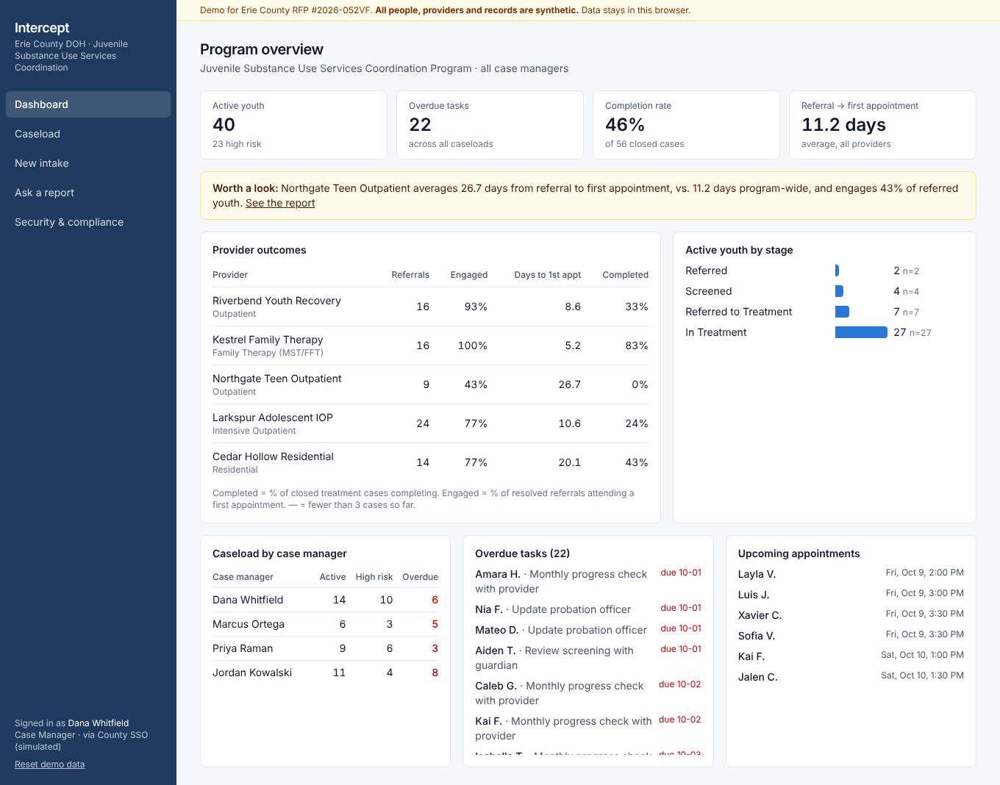

# Intercept: Juvenile Services Case Management (demo)

A working demo built in response to **Erie County, NY RFP #2026-052VF: Juvenile Justice Services Case Management Platform** (Department of Health; proposals due Oct 15, 2026). It was built as a Concourse Forward Deployed PM take-home.

> All people, providers and records are **synthetic**. Case data never leaves the browser.



## What it does

| For | Screen | RFP requirement it answers |
|---|---|---|
| Program supervisor | **Dashboard**: caseload by worker, overdue tasks, active-youth pipeline, **provider outcomes** with a flagged insight | §V Operational: "dashboard … case load, status, tasks, and outcomes"; §I "outcomes and practices of each treatment provider … to inform systems level improvements" |
| Case manager | **Caseload** search and filters → **Youth profile** with a stage-driven *next step*, case notes, tasks, appointment scheduling, contacts, audit trail | §V Programmatic: case management and planning, referrals, data at each intercept; §VI audit logs |
| Case manager | **New intake** → live **CRAFFT 2.1** screening with skip logic and scoring | §V Programmatic: validated screening tools for under-25s |
| Guardian | **Family portal**: appointments, plus **sign Part 2 consent** (typed e-signature, retained) | §V Programmatic: secondary portal; "forms requiring secure signatures … retained" |
| Treatment provider | **Provider portal**: only their referral; screening appears only after consent | §V Programmatic: portal for providers "without exposing … protected information" |
| Youth & guardian | **Text reminders** (simulated) with separate opt-ins and a privacy-safe template | §V Programmatic: text reminders to youth and families |
| Supervisor | **Data-quality checks** on the dashboard | Proposal Content §6: quality assurance measures |
| Supervisor / analyst | **Ask a report**: a plain-English question becomes an editable report, with CSV export | §V Operational: reports "without excessive coding by the end-user" |
| Evaluators | **Security & compliance**: every requirement marked *working / simulated / production commitment*, 6-week implementation timeline, 5-year cost, **one-click data and audit-log export** | §V Technical, §VI, Financial |

## Run it

```bash
npm install
npm run dev        # http://localhost:3000
npm test           # unit + RFP stress tests (S1–S7); zero model tokens
node scripts/e2e.mjs http://localhost:3000   # 36-check browser stress suite (needs Playwright)
npm run eval:model -- <url>                   # OPT-IN: scores the live model, spends ~19k tokens
```

AI report interpretation is optional. Copy `.env.example` to `.env.local` and set `CEREBRAS_API_KEY`. Without a key, the keyword-rules parser answers instead, and the UI says which one answered.

## Deploy (Vercel)

1. Vercel → **Add New Project** → import `spotterexchange/concourse-deliverable`. The framework is auto-detected and needs no build settings.
2. *(Optional)* Under **Settings → Environment Variables**, add `CEREBRAS_API_KEY`.
3. Deploy. Functions are pinned to `iad1` (US East) in `vercel.json`.

## Documentation

- [`docs/CONTEXT.md`](docs/CONTEXT.md): **start here**, the one-read briefing (assignment, RFP, build, how to record and submit)
- [`PLAN.md`](PLAN.md): RFP selection, scope, and timebox
- [`docs/ARCHITECTURE.md`](docs/ARCHITECTURE.md): system design, data model, request flows, production path
- [`docs/DECISIONS.md`](docs/DECISIONS.md): architecture decision records (why each choice was made)
- [`docs/RFP_TRACEABILITY.md`](docs/RFP_TRACEABILITY.md): requirement → feature mapping
- [`docs/STRESS_TEST.md`](docs/STRESS_TEST.md): stress test against the RFP, with before/after results and the defects it caught
- [`docs/PROCESS.md`](docs/PROCESS.md): how the build was directed with AI, and where we stopped
- [`docs/LOOM_SCRIPT.md`](docs/LOOM_SCRIPT.md): the buyer-facing walkthrough
