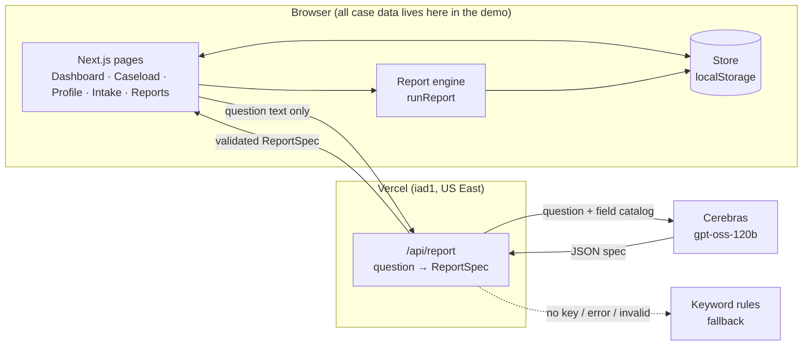

# Architecture

## Goals that shaped the design

1. **Demonstrate the scored workflow end to end.** Programmatic is worth 30% and Operational 15% of the evaluation. The demo has to *work*, not just show mockups.
2. **Never put County data at risk, even hypothetically.** Juvenile justice and substance-use records are among the most protected data a county holds (HIPAA, 42 CFR Part 2, NY Family Court Act confidentiality). The architecture should make the safe path the default one.
3. **Use AI where the RFP asks for flexibility.** The RFP's request for reports "without excessive coding by the end-user" is a natural fit for AI, and that's where the model is used. It is kept away from anything that needs to be exactly right.
4. **Cheap to run.** The budget is $17k in year one and $8k per year after. The free model tier means few tokens per request.

## System overview



**The key property:** the arrow into the model carries a question (≤200 characters) and the list of allowed field names. No record, name or ID ever crosses it. The spec comes back, is validated with zod, and is run **in the browser** against local data.

## Modules

| Path | Responsibility |
|---|---|
| `src/lib/types.ts` | Domain model: `Youth`, `Screening`, `Referral`, `Task`, `TimelineEvent`, `Provider`, stage and pathway enums |
| `src/lib/seed.ts` | Deterministic synthetic data. It *simulates* each case through time using per-provider parameters (wait, engagement, completion), so the metrics come out of a process rather than being invented |
| `src/lib/crafft.ts` | CRAFFT 2.1 items, skip logic and scoring; the screening tool library |
| `src/lib/store.tsx` | React context + localStorage persistence. Every mutation appends an attributed `TimelineEvent` (the audit trail) |
| `src/lib/query/spec.ts` | `ReportSpec` zod schema: the **only** contract between the model and the app |
| `src/lib/query/engine.ts` | Deterministic metric definitions and aggregation. The dashboard *and* the report builder both call it |
| `src/lib/query/rules.ts` | Keyword parser: fallback when the model is unavailable |
| `src/app/api/report/route.ts` | Model call with caching, rate limiting, timeout and validation |
| `src/lib/query/budget.ts` | Per-minute and daily model-call caps (token spend guard) |
| `src/lib/quality.ts` | Data-quality checks shown on the dashboard (RFP "quality assurance measures") |
| `src/lib/consent.ts` | Part 2 consent lookup that gates the provider portal |
| `src/lib/export.ts` | Full JSON export and audit-log CSV (County data ownership) |
| `src/lib/traceability.ts` | RFP requirement → status → answer. Rendered on `/security` |
| `tests/` · `scripts/e2e.mjs` | Unit and stress tests (S1–S7) and the 36-check browser stress suite. See `docs/STRESS_TEST.md` |

## Data model

```
Youth ─┬─ contacts[]   (Youth & Guardian w/ SMS opt-in, Probation Officer, Judge)
       ├─ documents[]  (signed forms: Part 2 consent; typed e-signature, timestamp)
       ├─ screenings[] (tool, raw answers, score, risk)   ← answers kept so a score is auditable
       ├─ referrals[]  (provider, referred, first appt, status, closed)
       ├─ tasks[]
       └─ timeline[]   (kind, text, actor, timestamp)     ← audit trail
Stage: Referred → Intake → Screened → Referred to Treatment → In Treatment → Completed | Discharged
```

**Why stages model the Sequential Intercept idea.** The RFP asks for "data capture at various intercepts to measure the rate of success of interventions." Each stage transition is a timestamped event, so time-between-stages and drop-off-by-stage come for free.

**Metric definitions live in code, once** (`engine.ts`):

| Metric | Denominator | Why this denominator |
|---|---|---|
| Completion rate | Closed cases (Completed + Discharged) | Open cases haven't had a chance to complete. Counting them would penalize providers taking recent referrals |
| Engagement rate | Referrals whose outcome is known (attended, or dropped) | Pending referrals are not failures yet |
| Days to first appointment | Referrals with an attended first appointment | Measures access, the earliest leading indicator |
| High-risk rate | Screened youth | — |

Every result carries `n`. The UI shows it, and the dashboard hides provider rates with fewer than 3 cases.

## Key flows

**Intake → outcome.** Intake form → CRAFFT (live score) → `addYouth` → profile shows the next step for the current stage (refer → mark first appointment → complete/discharge). Every click appends a timeline event and updates the dashboard immediately, because both read the same store.

**Who sees what (role views).**

| Field | Staff | Family portal | Provider portal |
|---|---|---|---|
| Appointments | ✓ | ✓ | ✓ (own referrals only) |
| Screening score / risk | ✓ | — | only after **Part 2 consent** is signed |
| Screening answers, case notes, tasks | ✓ | — | — |
| Court / probation / attorney | ✓ | — | — |
| Consent form to sign | — | ✓ | — |

The demo renders these views client-side. In production the same matrix is enforced server-side with row-level security, and the County edits it as configuration.

**Ask a report.**
1. Preset question? It uses the stored spec (0 tokens).
2. Asked before in this browser? It uses the localStorage cache (0 tokens).
3. Otherwise → `POST /api/report` → input validation → server cache → **budget check** (`budget.ts`) → model → zod validation → or rules fallback.
4. The spec is shown back as **editable chips** (measure, grouping, time, filters). A misread question is visible and fixable in one click, which matters more than a perfect parse.

## Production path (what changes after award)

| Demo | Production |
|---|---|
| localStorage store | Postgres in a US region (e.g. AWS GovCloud / us-east), encrypted at rest (AES-256), row-level security per role/caseload. The store's action names map 1:1 to API endpoints |
| Simulated signed-in user | OIDC/SAML federation to the **County IdP** with MFA enforced there, SCIM deprovisioning, no local accounts (RFP §VI.2) |
| Timeline events | Append-only audit table, ≥1-year retention, export API (RFP §VI.5) |
| Simulated SMS | Twilio (US) with consent capture and STOP handling. Templates never name the provider or service |
| Family portal preview | Separate authenticated portal. Field visibility comes from a County-editable role matrix |
| Cerebras free tier | A US-region inference endpoint under a BAA (provider is swappable via env, any OpenAI-compatible API). Same contract: question in, spec out |
| Fixed CRAFFT form | Form-definition JSON + a form builder, so the County adds GAIN-SS / PHQ-A without a code release |
